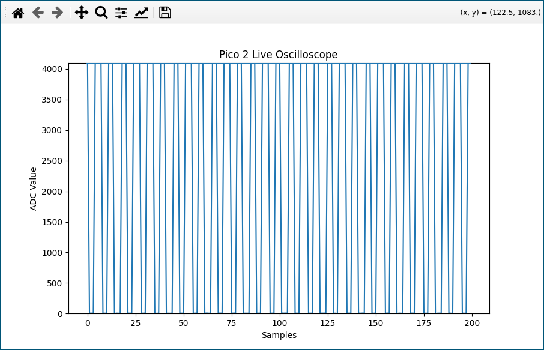

# pi2-oscilloscope

This project turns the Raspberry Pi Pico 2 into an
oscilloscope.

(simple square wave example)

Instead of the CPU manually asking for each value, the system is
designed as a hardware-only data path that captures signals at a
precise frequency (such as 44.1 kHz) and streams them to a PC via USB.

The core of the system is the Direct Memory Access (DMA) controller,
which acts as an autonomous "data mover." The ADC is configured in a
free-running mode, where a hardware clock divider triggers conversions
at exact intervals. As each sample is completed, it is pushed into a
hardware FIFO. The DMA controller listens for a specific hardware
signal (DREQ) from the ADC; the moment a sample is ready, the DMA
clears the FIFO and writes the value directly to RAM. This handshake
happens at the silicon level, ensuring every sample is spaced
perfectly in time, free from the "jitter" or delays typically caused
by software loops.

To handle the bottleneck of slow USB communication, the firmware uses
a Double Buffering (Ping-Pong) strategy. Two DMA channels are
"chained" together so that they work in a relay. When the first
channel finishes filling its buffer, it instantly triggers the second
channel to start filling a separate area of memory. This handoff
occurs in nanoseconds, preventing any "blind spots" or gaps in the
signal. While the hardware is busy filling the second buffer, the CPU
is finally alerted via an interrupt (IRQ) to format and send the first
completed buffer to the PC. Sending is done with a single write of the
entire buffer.

This design is highly efficient because it decouples high-speed
acquisition from slow data transmission. The CPU remains almost
entirely idle during the sampling phase, stepping in only to report
the data that the hardware has already collected. This ensures a
seamless, gapless stream of information, allowing the Pico 2 to act as
a professional-grade measurement tool.
